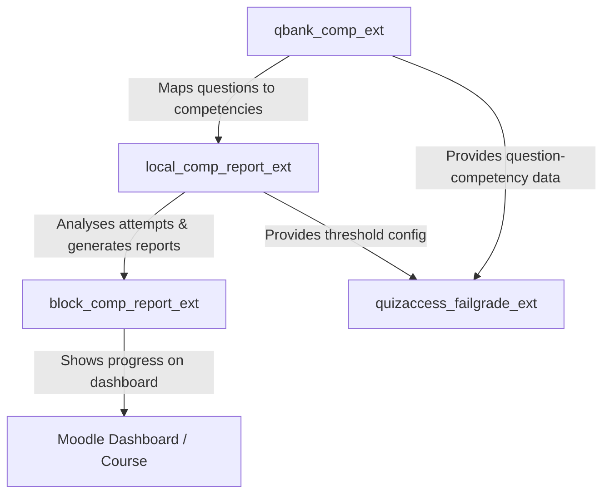

# 🎓 Moodle Question Bank Plugin: Competency (`qbank_comp_ext`)

[](https://moodle.org)
[](https://php.net)
[](https://docs.moodle.org)
[](http://www.gnu.org/copyleft/gpl.html)
[](https://github.com/engfeda-ui/competency)

A professional Moodle Question Bank plugin that allows course creators and teachers to link individual questions to specific Moodle competencies. This forms the data foundation of a competency-based assessment and learning analytics system.

By mapping questions to learning outcomes, educators can measure exactly which skills a student has mastered, rather than relying on generic pass/fail scores.

---

## ✨ Features

- **Direct Question-to-Competency Mapping:** Link any question in the Moodle Question Bank to one or multiple Moodle competencies via a dedicated column in the question bank UI.
- **Native Moodle Core Competency Integration:** Fully integrated with Moodle's official competency framework (`\core_competency\api`).
- **Data Foundation for Analytics:** Acts as the core data engine for `local_comp_report_ext`, `block_comp_report_ext`, and `quizaccess_failgrade_ext`.
- **Automated Tag-Based Mapping:** Automatically links questions to competencies using Moodle's native tag event observers — no manual intervention needed after import.
- **External API:** Exposes a secure web service (`save_question_competency`) for programmatic mapping, protected by `moodle/course:manageactivities`.
- **Localization Support:** English and Turkish language packs included.
- **Backup & Restore:** Mapping data is preserved when migrating courses.

---

## 📋 Requirements

| Dependency | Required Version / Compatibility |
| :--- | :--- |
| **Moodle Framework** | Moodle 4.5 to 5.0+ |
| **PHP Runtime** | PHP 8.1, PHP 8.2, PHP 8.3 |
| **Database System** | PostgreSQL 13+, MySQL 8.0+, or MariaDB 10.5+ |

> **Note:** `local_comp_report_ext` and `quizaccess_failgrade_ext` both declare `qbank_comp_ext` as a required dependency. Install this plugin first.

---

## 🚀 Installation

1. **Download & Extract:** Download the repository and extract the files.
2. **Directory Placement:** Copy the `competency` folder into your Moodle question bank plugins directory:
   ```
   moodle/question/bank/comp_ext
   ```
   > The folder must be named exactly `competency` inside `question/bank/`.
3. **Run Moodle Upgrade:** Log in as Administrator and navigate to **Site administration > Notifications**.
4. **Alternative Install:** Zip the directory and upload via **Site administration > Plugins > Install plugins**.

---

## 🛠️ Usage & Configuration

### Manual Mapping
1. Go to your **Course > Question Bank**.
2. For any question, click the **Edit** dropdown and choose **Competencies** (or click the competency icon in the question row).
3. Select the competency to associate with this question.
4. Save.

### Automated Tag-Based Mapping (GIFT Import)
The plugin listens to Moodle's tag events. When a question is tagged with a `comp-` prefix, the mapping is created automatically. Multiple competencies are supported!

1. **Add a tag to your GIFT file:**
   ```
   // [tag:comp-101, comp-102]
   ::Question Name:: Which database does Moodle support? { =All of them ~Only one }
   ```
2. **Import the GIFT file** into your course Question Bank.
3. The plugin detects the `comp-101` and `comp-102` tags, looks up the competencies by `idnumber` or `shortname`, and creates the mappings automatically.
4. **Removing the tag** later will also remove the mapping automatically.

---

## 🗄️ Database Schema

The plugin creates one table:

| Table | Purpose |
| :--- | :--- |
| `qbank_comp_ext_qmap` | Maps a question (`questionid`) to a competency (`competencyid`) within a course (`courseid`) |

**Key fields:** `id`, `courseid`, `questionid`, `competencyid`, `timecreated`

**Indexes:** `course_question_idx` on `(courseid, questionid)` for fast lookups.

---

## 💻 Directory Structure

```
competency/
├── amd/                    # AMD JavaScript modules for UI interactivity
├── classes/
│   ├── column/             # Question bank column definition
│   ├── external/           # Web service: save_question_competency
│   ├── privacy/            # GDPR Privacy provider
│   ├── observer.php        # Tag event observers (auto-mapping)
│   └── plugin_feature.php  # Registers the question bank column
├── db/
│   ├── install.xml         # Database schema
│   ├── access.php          # Capability definitions
│   └── services.php        # Web service definitions
├── lang/
│   └── en/                 # English language strings
├── version.php             # Plugin version and metadata
└── README.md
```

---

## 🔗 The Competency Ecosystem

This plugin is the data foundation of a 4-plugin competency-based education suite:



---

## 📋 Changelog

### v2.3.0 — 2026-07-24
- **Release:** Standardized frankenstyle component name to `qbank_comp_ext` installed under `question/bank/comp_ext`.

### v2.2.1 — 2026-07-05
- **Fix:** Resolved PHP 8.x compatibility issue in the GDPR Privacy Provider (`classes/privacy/provider.php`) caused by importing and type-hinting an invalid `core_privacy` context class instead of the global Moodle `\context` class.

### v2.2.0 — 2026-07-03
- **New:** Multi-Competency Support! You can now map a single question to multiple competencies.
- **Improvement:** The Question Bank column UI now uses a multi-select autocomplete widget to handle multiple competencies easily.
- **Improvement:** GIFT format imports and tag events now correctly map multiple competencies from a single question (e.g., `[tag:comp-A, comp-B]`).

### v2.1.0 — 2026-05-25
- **Ecosystem Sync:** Synchronized versioning and compatibility standards across the entire Moodle Competency Education Suite (v2026052500) to support advanced Local LLM analytics and brute-force quiz security upgrades.
- **Verification:** Full verification of all question-competency mappings against the latest Moodle 4.5+ and 5.0+ releases.

---

## 🔒 Security & Code Compliance

- **SQL Injection Prevention:** All queries use Moodle's `$DB` API with named parameter bindings.
- **Input Sanitization:** All input retrieved via `required_param()` / `optional_param()` with strict type filters.
- **Capability Controls:** External API enforces `moodle/course:manageactivities` before any write operation.
- **Namespace Compliance:** All classes under `\qbank_comp_ext\` namespace.
- **Coding Standards:** Compliant with Moodle's `PHP_CodeSniffer` (PHPCS) ruleset.

---

## 📄 License & Credits

- **Copyright:** © 2026 Mahmoud Salem
- **Based on work by:** 2026 Hakan Çiğci
- **License:** [GNU GPL v3](http://www.gnu.org/copyleft/gpl.html) or later.