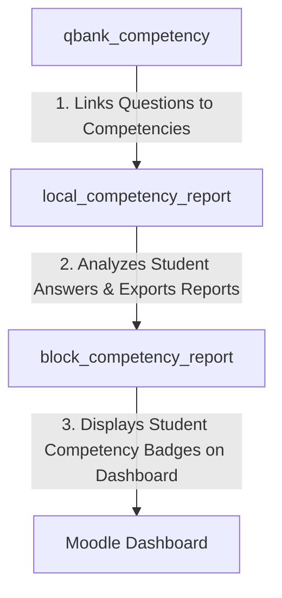

# 🎓 Moodle Question Bank Plugin: Competency (`qbank_competency`)

[](https://moodle.org)
[](https://php.net)
[](https://docs.moodle.org)
[](http://www.gnu.org/copyleft/gpl.html)

A professional Moodle Question Bank plugin that allows course creators and teachers to link individual questions to specific Moodle competencies. This forms the bedrock of a robust competency-based assessment and learning analytics system in Moodle.

By mapping questions to learning outcomes, educators can measure exactly which skills a student has mastered, rather than just relying on generic pass/fail scores.

---

## ✨ Features

- **Direct Question-to-Competency Mapping:** Link any question in the Moodle Question Bank to one or more Moodle competencies.
- **Native Moodle Core Competency Integration:** Fully integrated with Moodle’s official competency framework (`\core_competency\api`).
- **Data Foundation for Analytics:** Works as the core data engine for downstream reporting plugins like `local_competency_report` and `block_competency_report`.
- **Clean UI Integration:** Adds a intuitive competency management interface directly inside the Moodle Question Bank edit screen.
- **Enterprise Standards:**
  - Fully supports Moodle's language translation system (includes English and Turkish out-of-the-box).
  - Robust backup & restore support to keep mapping data intact when migrating courses.

---

## 📋 Requirements

| Dependency | Required Version / Compatibility |
| :--- | :--- |
| **Moodle Framework** | Moodle 4.5 to 5.0+ (Tested against Moodle 4.5/5.0+ stable branches) |
| **PHP Runtime** | PHP 8.1, PHP 8.2, PHP 8.3 |
| **Database System** | PostgreSQL 13+, MySQL 8.0+, or MariaDB 10.5+ |

---

## 🚀 Installation

Follow these steps to install the plugin manually:

1. **Download & Extract:** Download the repository and extract the files.
2. **Directory Placement:** Copy the `competency` folder into your Moodle installation's question bank plugins directory:
   ```bash
   moodle/question/bank/competency
   ```
   *Note: Ensure the folder is named exactly `competency` inside `question/bank/`.*
3. **Run Moodle Upgrade:** Log in to your Moodle site as an Administrator and navigate to **Site administration > Notifications** to trigger the database upgrade and complete the installation.
4. **Alternative Install:** Alternatively, zip the directory and upload it via **Site administration > Plugins > Install plugins**.

---

## 🛠️ Usage & Configuration

Once installed, mapping competencies to questions is simple:

1. Go to your **Course > Question Bank** (or **Site administration > Question Bank**).
2. For any question in the list, click the **Edit** dropdown and choose **Competencies** (or click the competencies icon next to the question).
3. Select the competency framework and choose the specific competency (or competencies) associated with this question.
4. Save the mapping.
5. **Downstream Reporting:** To generate reports and analyze student performance on these competency-linked questions, ensure you have installed the `local_competency_report` and `block_competency_report` plugins!

---

## 💻 Directory Structure

```text
competency/
├── classes/                # Autoloaded classes (Question bank column and form UI logic)
├── db/                     # Database definitions (install.xml, access.php, upgrade.php)
├── lang/                   # Language localization packs
│   ├── en/                 # English translations
│   └── tr/                 # Turkish translations
├── amd/                    # AMD JavaScript modules for UI interactivity
├── version.php             # Moodle plugin version and dependency definition
└── README.md               # Professional documentation
```

---

## 🔗 The Competency Ecosystem

This plugin is part of a complete 3-tier Moodle competency-based education suite:



1. **`qbank_competency`** *(This Plugin)*: Maps questions to specific skills/competencies in the question bank.
2. **`local_competency_report`**: Tracks quiz attempts, analyzes answers to mapped questions, calculates competency mastery percentages, and exports premium PDF reports.
3. **`block_competency_report`**: Renders an interactive overview block directly on the student’s dashboard to showcase their competency achievements across all courses.

---

## 🔒 Security & Code Compliance

This plugin has been audited and hardened according to Moodle's strict security and quality guidelines:

- **CSRF Protection:** Standard Moodle session key verification (`require_sesskey()`) is enforced on all state-mutating actions (such as queueing calculations).
- **SQL Injection Prevention:** Every query utilizes Moodle's Database API (`$DB`) with parameter bindings and named placeholders (`:named`), completely avoiding raw SQL interpolation and protecting against injection attacks.
- **Input Sanitization:** Direct superglobals (`$_GET`, `$_POST`, `$_REQUEST`) are strictly forbidden. Input retrieval uses standard Moodle validation helpers like `required_param()` and `optional_param()` with strict parameter type filters (`PARAM_INT`, `PARAM_BOOL`, etc.).
- **Capability Controls:** Page entry points verify course contexts with `require_login()` and validate explicit capabilities (e.g. `mod/quiz:viewreports`, `local_competency_report:viewreports`) via `require_capability()`.
- **Frankenstyle & Namespace Compliance:** Database tables and autoloaded classes are strictly prefixed and namespaced (e.g. `\local_competency_report\...` or `\quizaccess_failgrade\...`) preventing any class name or table name collisions.
- **Coding Standards:** Code is audited via `PHP_CodeSniffer` (PHPCS) enforcing clean syntax, proper DocBlocks, and standard Moodle conventions.

---

## 📄 License & Credits

- **Copyright:** © 2026 Mahmoud Salem
- **License:** Licensed under the [GNU GPL v3 License](http://www.gnu.org/copyleft/gpl.html) (or later).
